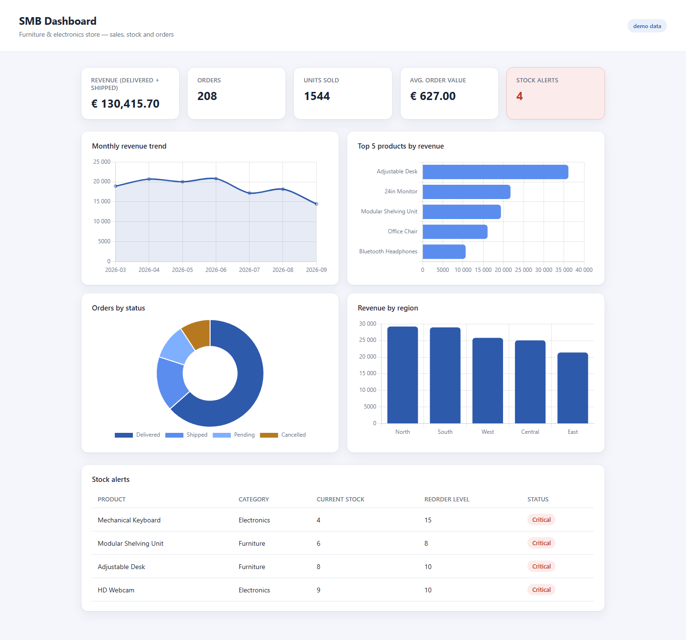

# SMB Sales, Stock & Orders Dashboard

**Portfolio demo — Python (FastAPI) + SQLite + Chart.js**

**Live demo: https://smb-dashboard-demo.onrender.com/**
(hosted on a free tier — it sleeps after inactivity, so the first load
can take 30-50 seconds)



## The problem

A small business (in this demo: a furniture & electronics store) has its
sales, stock and orders sitting in a database or spreadsheet, but the owner
has no single place to see how the business is doing — revenue trend, which
products sell, which orders are stuck, which products are about to run out
of stock. That usually means someone builds a pivot table by hand, or asks
"how's this month looking?" and waits.

## The solution

A lightweight, self-hosted web dashboard that reads directly from the
business's own database and shows, on one page:

- **KPI cards** — revenue, number of orders, units sold, average order
  value, and a live count of products needing reorder
- **Monthly revenue trend** — is the business growing or shrinking
- **Top 5 products by revenue** — what actually drives the numbers
- **Orders by status** — delivered / shipped / pending / cancelled, at a
  glance
- **Revenue by region**
- **Stock alerts table** — every product at or below its reorder level,
  flagged before it becomes a stockout

Revenue only counts delivered/shipped orders — pending and cancelled orders
are excluded from the realized-revenue figures, which is the rule a real
business owner actually wants.

## How it's built

```
seed_data.py  →  data/dashboard.db (SQLite)
                       ↓
                  app/db.py    (SQL queries: revenue, stock, orders)
                       ↓
                  app/main.py  (FastAPI: renders the page + a small JSON API)
                       ↓
              app/templates/dashboard.html + Chart.js (charts, in the browser)
```

- `app/db.py` — all reporting logic lives in plain SQL against SQLite.
  Porting to MySQL/Postgres is a small, contained change (swap the
  connection layer and the one SQLite-specific `strftime` call used for
  monthly grouping for that engine's date-formatting function) rather than
  a rewrite.
- `app/main.py` — FastAPI serves the dashboard page and also exposes the
  same data as JSON (`/api/summary`, `/api/monthly-revenue`,
  `/api/top-products`, `/api/stock-alerts`) — useful if this needs to feed
  another tool later.
- No client-side framework — server-rendered HTML + Chart.js from a CDN,
  so it's fast, simple to host, and easy for another developer to maintain.

## Run it yourself

```bash
python -m venv .venv
.venv\Scripts\activate        # or: source .venv/bin/activate
pip install -r requirements.txt

python seed_data.py                       # creates data/dashboard.db with demo data
uvicorn app.main:app --reload --port 8000
```

The app also seeds the database automatically on startup if
`data/dashboard.db` doesn't exist yet, so running `seed_data.py` by hand is
optional — that's what makes it deployable to a host with an ephemeral disk
(see below) without a manual setup step.

## Deploying (e.g. Render free tier)

- Build command: `pip install -r requirements.txt`
- Start command: `uvicorn app.main:app --host 0.0.0.0 --port $PORT`

No environment variables or manual database step needed.

Open http://127.0.0.1:8000/ in a browser.

## Tests

```bash
pytest
```

9 tests covering the SQL query layer (revenue/stock/status/region
aggregation against a seeded in-memory database) and the HTTP layer
(page renders, JSON endpoints, and that dashboard data is safely escaped
before being embedded in the page).

## Adaptable to your data

This demo runs on synthetic data seeded into SQLite. For a real engagement
it connects directly to your existing database (MySQL, Postgres, or an
Excel/CSV export processed on a schedule) and the KPIs, charts and alert
thresholds are built around what you actually need to see — customer
segments, delivery times, margin by product, multi-store comparisons, a
scheduled email digest, login-protected access, etc.

## Stack

Python, FastAPI, SQLite, Jinja2, Chart.js.
